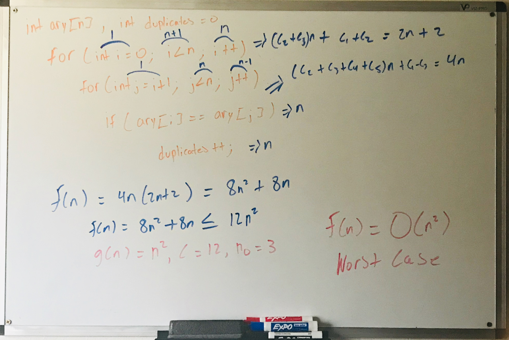

# Algo_Analysis-Assignments
Assignments from Analysis of Algorithms at CSU East Bay 

# Homework 1

## (1) 
```c++
int main() {
    int n;
    int duplicates = 0;

    cout << "Indicate number of integers: ";
    cin >> n;
    int ary[n];

    for (int i = 0; i < n; i++) {
        cout << "Enter a integer: ";
        cin >> ary[i];
    }

    for (int i = 0; i < n; i++) {
        for (int j = i + 1; j < n; j++) {
            if (ary[i] == ary[j]) {
                duplicates++;
            }
        }
    }

    cout << "\nTotal number of duplicates: " << duplicates << endl;  

    return 0;
}
```



