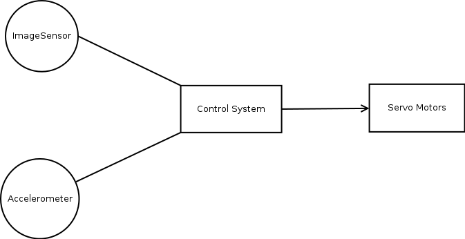
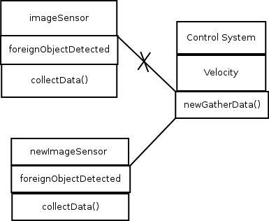
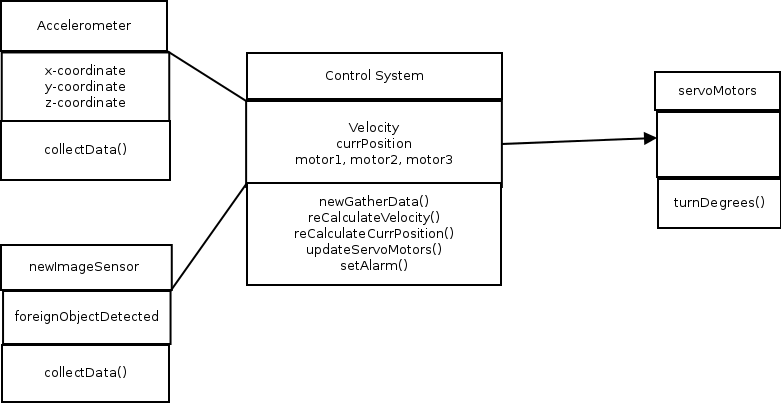

# CS 401 Quiz 3

  

### Manufacturing Robot Control System

### Q1

#### ( a )
### Subsystems 
- Control System  - Interacts and processes sensor information and calculates current position and velocity of the Robotic arm.  
- Servo Motors (3 arm joints) - is dependent on the control system to update motor positions.  

### Interfaces 
- Accelerometer - data of measurements along the xyz axis.  
- Image Sensor - visual feedback.  

#### ( b )

 
 
#### ( c )

The Control System will identify and properly handle errors or miscalculations.  

### Q2

#### ( a )
i.  To incorporate the requirement of a new image interface I would reconfigure the method in the control system class that gathers the image data to be able to gather the newly formatted data.  

ii.    
   

#### ( b )
i.  
     - Software Subsystem
     - Control System
     - Robotic Arm 
     - ImageSensor
     - Accelerometer 
     - ServoMotors  
     - parts 
     
ii. 

    ``` mermaid
    classDiagram 
     Control System {
        velocity
        updateServoMotor()
      }
      ImageSensor {
        foreignObjectDetected 
        collectDate()
      }
      Accelerometer {
        x-coordinate
        collectData()
      } 
      ServoMotor {
        turnDegrees()
      }
 
 iii. 
  
    
